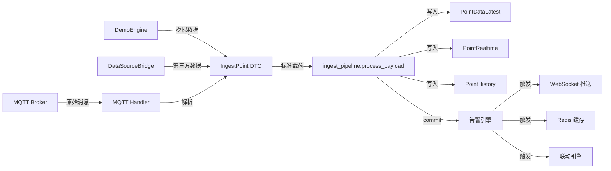
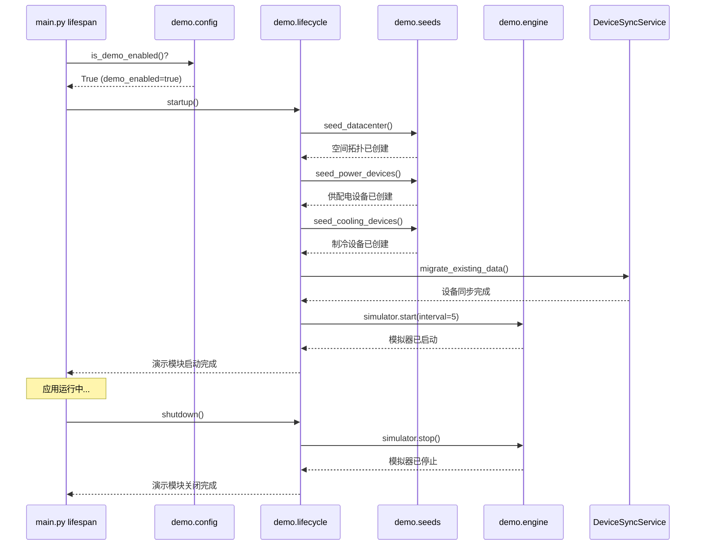
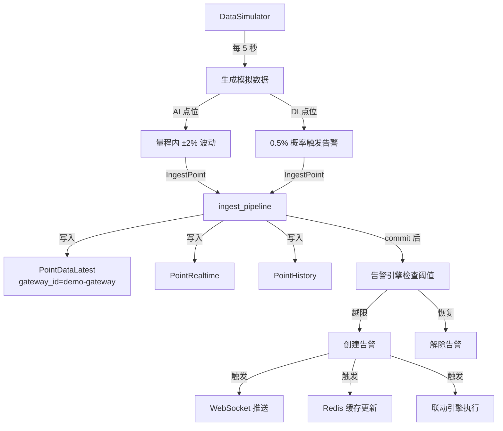

# 演示系统架构文档

## 概述

演示系统是 DCIM 项目的独立可选模块，提供完整的 4 层楼数据中心模拟环境（628 台设备、2830 个采集点），支持按需加载、日期刷新、完整卸载。通过虚拟 Gateway 模式，演示数据走真实采集链路，与生产环境保持一致。

## 核心特性

| 特性 | 说明 |
|------|------|
| 完全解耦 | 独立模块 `backend/app/demo/`，条件加载，不影响核心功能 |
| 统一入库 | 通过 `ingest_pipeline.py` 与 MQTT 共用入库管道 |
| 虚拟 Gateway | 模拟数据标记 `gateway_id="demo-gateway"`，走真实采集链路 |
| 按需加载 | 通过 API 触发加载，支持日期偏移（演示历史/未来场景） |
| 完整卸载 | 72 张表清理 + Redis 缓存清理，恢复空白状态 |
| 4 层楼模型 | 628 台设备（UPS/配电柜/PDU/空调/传感器），2830 个采集点 |

## 架构设计

### 1. 统一入库管道



**关键设计**:
- 所有数据源统一通过 `IngestPoint` DTO 标准化
- 单一入口 `process_payload()` 执行完整链路
- 演示数据通过 `source="demo"` 和 `gateway_id="demo-gateway"` 标识
- 与 MQTT 数据共用告警/联动/WebSocket/Redis 逻辑

### 2. 演示模块目录结构

```
backend/app/demo/
├── __init__.py           # 模块导出
├── config.py             # 配置检查 (is_demo_enabled)
├── lifecycle.py          # 生命周期钩子 (startup/shutdown)
├── engine.py             # 数据模拟器 (DataSimulator)
├── service.py            # 演示数据服务 (DemoDataService)
├── router.py             # API 路由 (/api/v1/demo)
└── seeds/                # 种子数据生成器
    ├── datacenter_seed.py  # 空间拓扑 (站点/楼层/房间/列)
    ├── power_seed.py       # 供配电设备 (UPS/配电柜/PDU)
    └── cooling_seed.py     # 制冷设备 (空调/传感器)
```

### 3. 演示模块生命周期



**启动流程**:
1. `main.py` 检查 `demo_enabled` 配置
2. 调用 `demo.lifecycle.startup()`
3. 执行种子数据初始化（幂等，已存在则跳过）
4. 双向同步拓扑节点 ↔ 动环设备（通过 `device_code` 匹配）
5. 启动数据模拟器后台任务（5 秒间隔）

**关闭流程**:
1. `main.py` 调用 `demo.lifecycle.shutdown()`
2. 停止模拟器，取消后台任务
3. 清理资源

### 4. 数据流向



**数据特征**:
- AI 点位: 根据设备类型设置基准值（温度 24℃、湿度 50%、负载率 45% 等），小幅波动 ±2%
- DI 点位: 0.5% 概率触发告警（模拟设备故障）
- 所有数据标记 `source="demo"` 和 `gateway_id="demo-gateway"`
- 自动保存到 `PointHistory` 表（历史数据查询）

### 5. 虚拟 Gateway 模式

演示数据通过虚拟网关 `demo-gateway` 标识，走真实采集链路:

```python
# demo/engine.py
async def _generate_and_ingest(self):
    """生成并入库模拟数据"""
    from ..services.ingest_pipeline import process_payload, IngestPoint
    
    points = []
    for point in all_points:
        value = self.generate_ai_value(point, current_value)
        points.append(
            IngestPoint(
                point_id=point.id,
                value=value,
                quality=0,
                timestamp=datetime.now(),
                status="normal",
                gateway_id="demo-gateway",  # 虚拟网关标识
                point_key=point.point_code,
                source="demo",  # 来源标识
            )
        )
    
    # 统一入库管道
    result = await process_payload(points)
```

**优势**:
- 演示数据与 MQTT 数据共用告警/联动/WebSocket/Redis 逻辑
- 可通过 `gateway_id` 过滤演示数据
- 支持在 `PointDataLatest` 表查看最新值
- 完整模拟真实采集场景

## 4 层楼数据模型

### 空间拓扑

```
站点: 北京数据中心 (site_code=BJ-DC-01)
├── 楼层 1F (floor_code=BJ-DC-01-1F)
│   ├── 房间 101 (room_code=BJ-DC-01-1F-101)
│   │   ├── 列 A (row_code=BJ-DC-01-1F-101-A)
│   │   │   ├── 机柜 A01-A10 (10 个)
│   │   │   └── PDU 20 台
│   │   └── 列 B (row_code=BJ-DC-01-1F-101-B)
│   │       ├── 机柜 B01-B10 (10 个)
│   │       └── PDU 20 台
│   └── 房间 102 (room_code=BJ-DC-01-1F-102)
│       └── ... (同上)
├── 楼层 2F (floor_code=BJ-DC-01-2F)
│   └── ... (同 1F)
├── 楼层 3F (floor_code=BJ-DC-01-3F)
│   └── ... (同 1F)
└── 楼层 4F (floor_code=BJ-DC-01-4F)
    └── ... (同 1F)
```

### 设备统计

| 设备类型 | 数量 | 采集点数 | 说明 |
|---------|------|---------|------|
| UPS | 8 台 | 96 点 | 每台 12 点（输入电压/电流/频率、输出电压/电流/频率、负载率、电池电量/温度、旁路状态、故障告警、运行模式） |
| 配电柜 | 40 台 | 400 点 | 每台 10 点（总电流/电压/功率、A/B/C 相电流、功率因数、频率、温度、开关状态） |
| PDU | 320 台 | 960 点 | 每台 3 点（总电流、总功率、温度） |
| 精密空调 | 80 台 | 800 点 | 每台 10 点（送风温度/湿度、回风温度/湿度、冷冻水进/出水温度、运行状态、告警状态、功率、风机转速） |
| 温湿度传感器 | 160 台 | 480 点 | 每台 3 点（温度、湿度、露点） |
| 漏水传感器 | 20 台 | 20 点 | 每台 1 点（漏水告警） |
| **总计** | **628 台** | **2830 点** | |

### 采集点分布

| 点位类型 | 数量 | 占比 | 说明 |
|---------|------|------|------|
| AI (模拟量输入) | 2650 点 | 93.6% | 温度/湿度/电压/电流/功率/负载率等 |
| DI (数字量输入) | 180 点 | 6.4% | 开关状态/告警状态/运行模式等 |

## API 接口

### 演示数据管理 (/api/v1/demo)

| 方法 | 路径 | 说明 | 参数 |
|------|------|------|------|
| POST | /demo/load | 加载演示数据 | `date_offset_days` (可选, 日期偏移天数) |
| DELETE | /demo/unload | 卸载演示数据 | 无 |
| POST | /demo/refresh-dates | 刷新日期 | `date_offset_days` (必填, 日期偏移天数) |
| GET | /demo/status | 演示数据状态 | 无 |
| GET | /demo/stats | 演示数据统计 | 无 |

### 加载演示数据

```bash
# 加载当前日期数据
curl -X POST "http://localhost:8080/api/v1/demo/load" \
  -H "Authorization: Bearer <token>"

# 加载 30 天前数据（演示历史场景）
curl -X POST "http://localhost:8080/api/v1/demo/load?date_offset_days=-30" \
  -H "Authorization: Bearer <token>"

# 加载 7 天后数据（演示未来场景）
curl -X POST "http://localhost:8080/api/v1/demo/load?date_offset_days=7" \
  -H "Authorization: Bearer <token>"
```

**响应示例**:
```json
{
  "status": "success",
  "message": "演示数据加载完成",
  "stats": {
    "sites": 1,
    "floors": 4,
    "rooms": 8,
    "rows": 16,
    "devices": 628,
    "points": 2830,
    "thresholds": 2830,
    "date_offset_days": 0
  }
}
```

### 卸载演示数据

```bash
curl -X DELETE "http://localhost:8080/api/v1/demo/unload" \
  -H "Authorization: Bearer <token>"
```

**清理范围**（72 张表）:
- 空间拓扑: Site, Floor, Room, Row, Cabinet
- 设备: Device, Point, PointRealtime, PointHistory, PointDataLatest
- 告警: Alarm, AlarmThreshold, AlarmRule, AlarmShield
- 能源: Transformer, MeterPoint, DistributionPanel, PowerDevice, EnergyHourly, EnergyDaily, EnergyMonthly, PUEHistory 等 40+ 张表
- 资产: Asset, AssetLifecycle, MaintenanceRecord
- 运维: WorkOrder, InspectionPlan, KnowledgeBase
- 容量: SpaceCapacity, PowerCapacity, CoolingCapacity, WeightCapacity
- 拓扑: TopologyNode, TopologyEdge, PDUPhaseConfig
- 联动: LinkagePolicy, LinkageExecution, DiagnosisRule
- 视频: NVR, Camera, VideoEvent
- Redis 缓存: `realtime:*`, `alarm:*`, `energy:*`

### 刷新日期

```bash
# 将所有时间戳向前偏移 30 天
curl -X POST "http://localhost:8080/api/v1/demo/refresh-dates?date_offset_days=-30" \
  -H "Authorization: Bearer <token>"
```

**影响范围**:
- PointHistory.timestamp
- Alarm.alarm_time, resolved_time
- EnergyHourly/Daily/Monthly.timestamp
- PUEHistory.timestamp
- WorkOrder.created_at, updated_at
- 其他所有时间戳字段

### 查询状态

```bash
curl -X GET "http://localhost:8080/api/v1/demo/status" \
  -H "Authorization: Bearer <token>"
```

**响应示例**:
```json
{
  "demo_enabled": true,
  "simulator_running": true,
  "data_loaded": true,
  "gateway_id": "demo-gateway",
  "last_update": "2026-03-01T12:34:56"
}
```

## 配置说明

### 环境变量

```env
# 启用演示模式（二选一）
DEMO_ENABLED=true
SIMULATION_ENABLED=true

# 模拟器间隔（秒）
SIMULATION_INTERVAL=5
```

### 配置检查

```python
from app.demo.config import is_demo_enabled

if is_demo_enabled():
    # 演示模式已启用
    pass
```

## 开发指南

### 如何启用/禁用演示模式

**方式一: 环境变量**
```bash
# .env 文件
DEMO_ENABLED=true  # 启用
DEMO_ENABLED=false # 禁用
```

**方式二: 配置文件**
```python
# backend/app/core/config.py
class Settings(BaseSettings):
    demo_enabled: bool = True  # 默认启用
```

**方式三: 运行时控制**
```python
# main.py
if is_demo_enabled():
    await demo.lifecycle.startup()
```

### 如何添加新的演示设备类型

1. 在 `demo/seeds/` 创建新的种子文件（如 `security_seed.py`）
2. 定义设备配置数据
3. 实现种子函数 `seed_security_devices()`
4. 在 `demo/lifecycle.py` 中调用

**示例**:
```python
# demo/seeds/security_seed.py
async def seed_security_devices():
    """初始化安防设备"""
    async with async_session() as session:
        # 检查是否已存在
        result = await session.execute(
            select(Device).where(Device.device_type == "CAMERA")
        )
        if result.first():
            return
        
        # 创建设备
        for floor in range(1, 5):
            for room in range(1, 3):
                device = Device(
                    device_code=f"CAM-{floor}F-{room:02d}",
                    device_name=f"{floor}F-{room:02d} 摄像头",
                    device_type="CAMERA",
                    area_code=f"BJ-DC-01-{floor}F-{room:02d}",
                )
                session.add(device)
        
        await session.commit()
```

### 如何扩展数据生成算法

在 `demo/engine.py` 的 `DataSimulator` 类中扩展:

```python
def generate_ai_value(self, point: Point, current_value: float = None) -> float:
    """生成模拟量输入值"""
    # 添加新的设备类型逻辑
    if "摄像头在线率" in point.point_name:
        current_value = 98 + random.uniform(-2, 2)
    elif "视频码率" in point.point_name:
        current_value = 4000 + random.uniform(-500, 500)
    
    # 模拟小幅波动
    variation = (max_val - min_val) * 0.02
    delta = random.uniform(-variation, variation)
    new_value = current_value + delta
    
    return round(new_value, 2)
```

### 测试演示功能的最佳实践

**单元测试**:
```python
# tests/demo/test_engine.py
import pytest
from app.demo.engine import DataSimulator

@pytest.mark.asyncio
async def test_simulator_generates_data():
    simulator = DataSimulator()
    await simulator.start(interval=1)
    await asyncio.sleep(2)
    simulator.stop()
    
    # 验证数据已生成
    async with async_session() as session:
        result = await session.execute(
            select(PointRealtime).where(PointRealtime.gateway_id == "demo-gateway")
        )
        assert result.first() is not None
```

**集成测试**:
```python
# tests/demo/test_lifecycle.py
import pytest
from app.demo import lifecycle

@pytest.mark.asyncio
async def test_demo_lifecycle():
    # 启动
    await lifecycle.startup()
    
    # 验证种子数据
    async with async_session() as session:
        result = await session.execute(select(Site))
        assert result.first() is not None
    
    # 关闭
    await lifecycle.shutdown()
```

**API 测试**:
```bash
# 加载演示数据
pytest tests/api/test_demo.py::test_load_demo_data

# 卸载演示数据
pytest tests/api/test_demo.py::test_unload_demo_data

# 刷新日期
pytest tests/api/test_demo.py::test_refresh_dates
```

## 关键设计决策

1. **完全解耦**: 演示模块独立于核心功能，通过条件加载实现，不影响生产环境
2. **统一入库**: 演示数据与 MQTT 数据共用 `ingest_pipeline`，确保逻辑一致性
3. **虚拟 Gateway**: 通过 `gateway_id="demo-gateway"` 标识，支持过滤和追溯
4. **按需加载**: 通过 API 触发加载，支持日期偏移，灵活演示不同场景
5. **完整卸载**: 72 张表清理 + Redis 缓存清理，确保干净恢复
6. **幂等种子**: 种子函数幂等设计，重复执行不会重复创建数据
7. **双向同步**: 拓扑节点 ↔ 动环设备通过 `device_code` 自动关联
8. **真实链路**: 演示数据走真实告警/联动/WebSocket/Redis 链路，完整模拟生产环境

## 性能考虑

| 指标 | 数值 | 说明 |
|------|------|------|
| 模拟器间隔 | 5 秒 | 可通过 `SIMULATION_INTERVAL` 调整 |
| 单次入库点数 | 2830 点 | 批量入库，性能优化 |
| 内存占用 | ~50MB | 点位元数据缓存 |
| 数据库写入 | ~5.6k 行/秒 | PointHistory 表（2830 点 × 2 次/秒） |
| Redis 缓存 | ~2830 键 | `realtime:point:{point_id}` |

**优化建议**:
- 生产环境建议关闭演示模式（`DEMO_ENABLED=false`）
- 大规模演示场景可调整 `SIMULATION_INTERVAL` 到 10-30 秒
- 定期清理 `PointHistory` 历史数据（保留 30-90 天）

## 故障排查

### 演示数据未生成

**检查配置**:
```bash
# 确认演示模式已启用
grep DEMO_ENABLED .env
grep SIMULATION_ENABLED .env
```

**检查日志**:
```bash
# 查看启动日志
tail -f logs/app.log | grep "演示模块"

# 预期输出:
# 演示模块: 启动中...
# 演示模块: 种子数据已初始化
# 演示模块: 设备同步完成
# 演示模块: 模拟器已启动 (interval=5s)
```

**检查数据库**:
```sql
-- 检查点位数量
SELECT COUNT(*) FROM point;

-- 检查实时数据
SELECT COUNT(*) FROM point_realtime WHERE gateway_id = 'demo-gateway';

-- 检查历史数据
SELECT COUNT(*) FROM point_history WHERE point_id IN (
    SELECT id FROM point WHERE device_id IN (
        SELECT id FROM device WHERE device_code LIKE 'BJ-DC-01-%'
    )
);
```

### 模拟器未运行

**检查后台任务**:
```python
# 在 Python shell 中
from app.demo.engine import simulator
print(simulator.running)  # 应为 True
```

**手动启动**:
```python
from app.demo import lifecycle
await lifecycle.startup()
```

### 数据卸载不完整

**手动清理**:
```bash
# 删除数据库文件（开发环境）
rm dcim.db

# 重新初始化
cd backend
uvicorn app.main:app --reload
```

**检查 Redis**:
```bash
redis-cli
> KEYS realtime:*
> KEYS alarm:*
> FLUSHDB  # 清空当前数据库
```

## 相关文档

- [后端架构文档](architecture-backend.md)
- [API 接口契约](api-contracts-backend.md)
- [开发指南](development-guide.md)
- [数据模型文档](data-models-backend.md)

## 更新日志

### V3.1.0 (2026-03-01)
- 完成演示系统解耦重构
- 新增统一入库管道 `ingest_pipeline.py`
- 新增虚拟 Gateway 模式
- 新增 4 层楼数据模型（628 台设备、2830 个采集点）
- 新增完整卸载逻辑（72 张表清理）
- 新增日期刷新功能
- 新增演示数据状态查询 API
