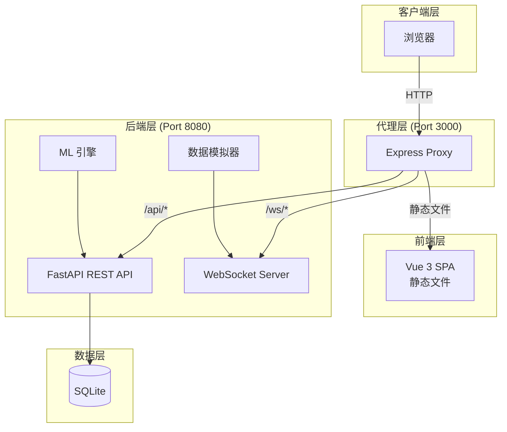
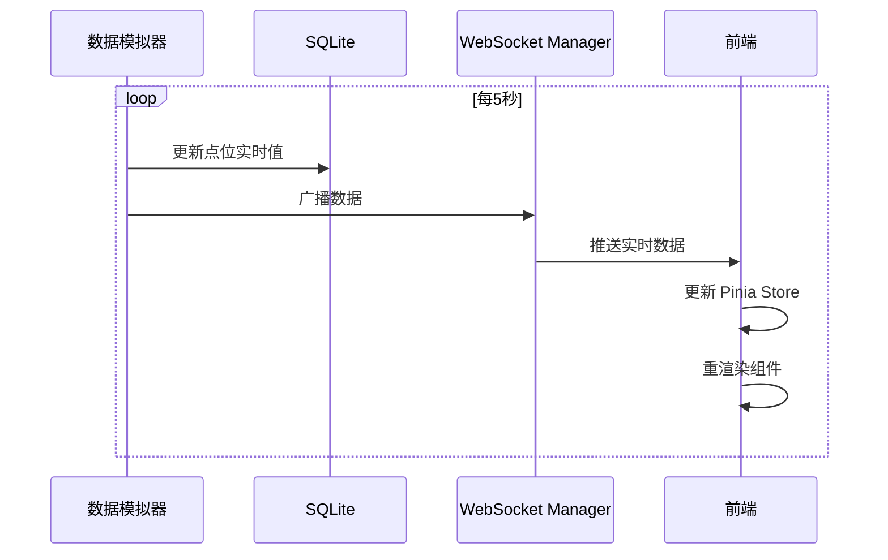
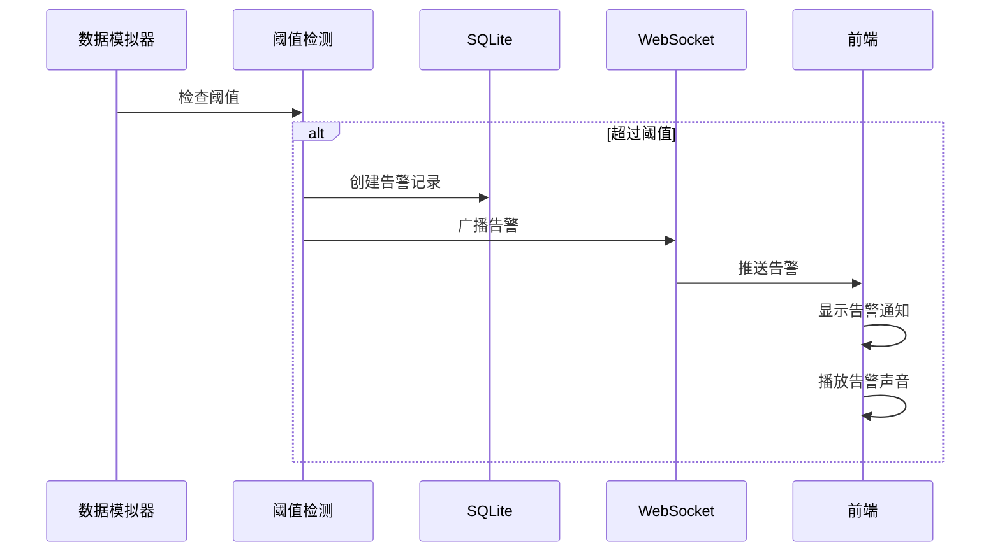
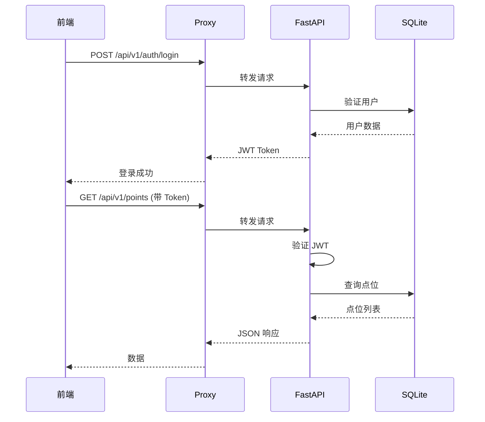

# 集成架构文档 - 算力中心智能监控系统 (DCIM)

## 系统概览

本系统采用**多部分分离架构**，包含三个独立的服务模块：



## 部分间通信

### 通信矩阵

| 源 | 目标 | 协议 | 路径 | 用途 |
|----|------|------|------|------|
| 浏览器 | Proxy | HTTP/HTTPS | `/*` | 所有请求入口 |
| Proxy | Frontend dist | 文件系统 | `/` | 静态文件服务 |
| Proxy | Backend | HTTP | `/api/*` | REST API 转发 |
| Proxy | Backend | WebSocket | `/ws/*` | 实时数据转发 |
| Frontend | Backend | HTTP (via Proxy) | `/api/v1/*` | API 调用 |
| Frontend | Backend | WebSocket (via Proxy) | `/ws/realtime`, `/ws/alarms` | 实时推送 |

### Proxy 服务详解

**位置**: `proxy/server.js`

**功能**:
1. **静态文件服务** - 服务 `frontend/dist/` 构建产物
2. **API 代理** - 转发 `/api/*` 到后端 8080 端口
3. **WebSocket 代理** - 转发 `/ws/*` 实时连接
4. **Swagger 代理** - 转发 `/docs` 和 `/openapi.json`
5. **SPA 路由支持** - 所有未匹配路径返回 `index.html`

```javascript
// 核心代理配置
app.use('/api', createProxyMiddleware({
    target: 'http://localhost:8080',
    changeOrigin: true,
    ws: true
}));
```

### 前端 → 后端 API 集成

**API 客户端配置**: `frontend/src/utils/request.ts`

```typescript
// Axios 实例配置
const request = axios.create({
    baseURL: '/api/v1',
    timeout: 10000
});

// 请求拦截 - 添加 JWT Token
request.interceptors.request.use(config => {
    const token = useUserStore().token;
    if (token) {
        config.headers.Authorization = `Bearer ${token}`;
    }
    return config;
});
```

**API 模块结构**:
```
frontend/src/api/
├── modules/
│   ├── auth.ts      # 认证 API
│   ├── user.ts      # 用户管理
│   ├── device.ts    # 设备管理
│   ├── point.ts     # 点位管理
│   ├── alarm.ts     # 告警管理
│   ├── energy.ts    # 能源管理
│   ├── history.ts   # 历史数据
│   ├── report.ts    # 报表
│   └── ...          # 更多模块
├── websocket.ts     # WebSocket 客户端
└── index.ts         # 统一导出
```

### WebSocket 实时通信

**连接端点**:

| 端点 | 用途 | 认证 |
|------|------|------|
| `/ws/realtime` | 实时数据推送 | JWT Token |
| `/ws/alarms` | 告警推送 | JWT Token |
| `/ws/system` | 系统状态 | JWT Token |

**前端 WebSocket 管理**: `frontend/src/api/websocket.ts`

```typescript
// WebSocket 连接示例
const ws = new WebSocket(`ws://host/ws/realtime?token=${token}`);

ws.onmessage = (event) => {
    const data = JSON.parse(event.data);
    // 更新 Pinia store
    realtimeStore.updateData(data);
};
```

**后端 WebSocket 管理**: `backend/app/services/websocket.py`

```python
class WebSocketManager:
    async def connect(self, websocket: WebSocket, channel: str):
        await websocket.accept()
        self.active_connections[channel].append(websocket)

    async def broadcast(self, channel: str, message: dict):
        for connection in self.active_connections[channel]:
            await connection.send_json(message)
```

## 数据流

### 实时数据流



### 告警数据流



### API 请求流



## 认证机制

### JWT 认证流程

1. **登录**: 前端发送用户名/密码到 `/api/v1/auth/login`
2. **验证**: 后端验证凭据，生成 JWT Token
3. **存储**: 前端将 Token 存储在 Pinia store（内存）
4. **使用**: 后续请求在 `Authorization: Bearer <token>` 头中携带
5. **验证**: 后端验证每个请求的 Token
6. **刷新**: Token 过期前可调用 `/api/v1/auth/refresh` 刷新

### WebSocket 认证

```
ws://host/ws/realtime?token=<JWT_TOKEN>
```

后端在连接时验证 Token:
```python
@app.websocket("/ws/realtime")
async def websocket_realtime(websocket: WebSocket, token: str = Query(None)):
    if not await verify_websocket_token(token):
        await websocket.close(code=4001, reason="Unauthorized")
        return
    # 连接成功
```

## 状态管理

### Pinia Stores

| Store | 用途 | 数据来源 |
|-------|------|----------|
| `userStore` | 用户信息、Token | 登录 API |
| `realtimeStore` | 实时点位数据 | WebSocket |
| `alarmStore` | 告警列表 | WebSocket + API |
| `energyStore` | 能源数据 | API |
| `appStore` | 应用状态 | 本地 |

### 状态同步

```typescript
// 实时数据通过 WebSocket 自动同步到 Store
const realtimeStore = useRealtimeStore();

websocket.onmessage = (event) => {
    const data = JSON.parse(event.data);
    realtimeStore.setRealtimeData(data);
};
```

## 错误处理

### API 错误响应格式

```json
{
    "detail": "错误描述",
    "code": "ERROR_CODE"
}
```

### 前端错误处理

```typescript
// Axios 响应拦截器
request.interceptors.response.use(
    response => response,
    error => {
        if (error.response?.status === 401) {
            userStore.logout();
            router.push('/login');
        }
        ElMessage.error(error.response?.data?.detail || '请求失败');
        return Promise.reject(error);
    }
);
```

### WebSocket 重连机制

```typescript
function connectWebSocket() {
    const ws = new WebSocket(url);

    ws.onclose = () => {
        // 5秒后重连
        setTimeout(connectWebSocket, 5000);
    };

    ws.onerror = () => {
        ws.close();
    };
}
```

## 配置同步

### 环境变量

**前端** (`frontend/.env`):
```env
VITE_API_BASE_URL=http://localhost:8080/api/v1
VITE_WS_URL=ws://localhost:8080/ws
```

**后端** (`backend/.env`):
```env
CORS_ORIGINS=http://localhost:3000,http://localhost:5173
SECRET_KEY=...
```

**Proxy** (`proxy/server.js`):
```javascript
const BACKEND_PORT = 8080;
const BACKEND_URL = 'http://localhost:' + BACKEND_PORT;
```

## 性能优化

### 前端优化

- **代码分割**: 路由级别懒加载
- **组件缓存**: 使用 `<keep-alive>` 缓存页面
- **WebSocket**: 使用单一连接复用多个频道

### 后端优化

- **异步处理**: FastAPI + asyncio
- **数据库连接池**: SQLAlchemy async session
- **批量推送**: WebSocket 消息合并

### Proxy 优化

- **静态资源缓存**: 1年缓存期
- **Gzip 压缩**: 文本资源压缩
- **Connection Keep-Alive**: 连接复用

---

*最后更新: 2026-02-01*
